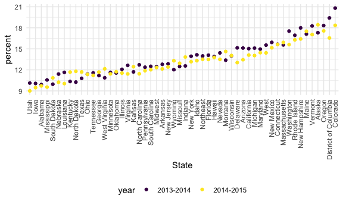
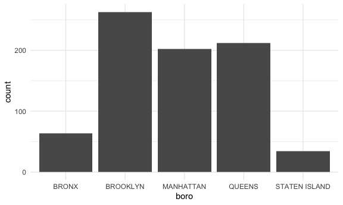
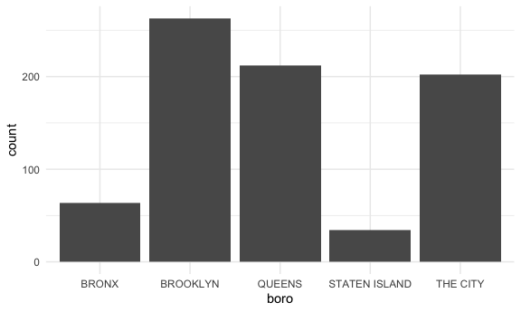
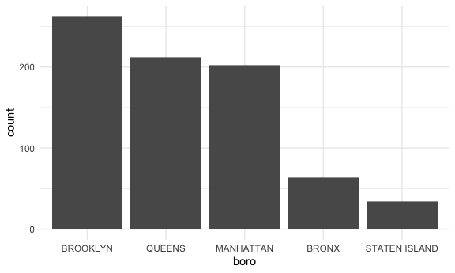

strings and factors
================

load the package need for this one

``` r
library(rvest)
```

    ## 
    ## Attaching package: 'rvest'

    ## The following object is masked from 'package:readr':
    ## 
    ##     guess_encoding

``` r
library(p8105.datasets)
```

## Let’s do strings

``` r
string_vec = c("my", "name", "is", "cathy")

str_detect(string_vec, "cathy") # need to have percice match, upper case and lower case
```

    ## [1] FALSE FALSE FALSE  TRUE

``` r
str_replace(string_vec, "cathy", "Cahty")
```

    ## [1] "my"    "name"  "is"    "Cahty"

``` r
str_replace(string_vec, "a", "A")
```

    ## [1] "my"    "nAme"  "is"    "cAthy"

``` r
string_vec = c(
  "i think we all rule for participating",
  "i think i have been caught",
  "i think this will be quite fun actually",
  "it will be fun, i think"
  )

str_detect(string_vec, "i think")
```

    ## [1] TRUE TRUE TRUE TRUE

``` r
str_detect(string_vec, "^i think") # ^ beginning of the line  with "i think"
```

    ## [1]  TRUE  TRUE  TRUE FALSE

``` r
str_detect(string_vec, "^i think$")  # $ end with "i think"
```

    ## [1] FALSE FALSE FALSE FALSE

``` r
string_vec = c(
  "Time for a Pumpkin Spice Latte!",
  "went to the #pumpkinpatch last weekend",
  "Pumpkin Pie is obviously the best pie",
  "SMASHING PUMPKINS -- LIVE IN CONCERT!!"
  )

str_detect(string_vec,"pumpkin")
```

    ## [1] FALSE  TRUE FALSE FALSE

``` r
str_detect(string_vec,"Pumpkin")
```

    ## [1]  TRUE FALSE  TRUE FALSE

``` r
str_detect(string_vec,"[Pp]umpkin") # can find 2 types of P and p 
```

    ## [1]  TRUE  TRUE  TRUE FALSE

``` r
string_vec = c(
  '7th inning stretch',
  '1st half soon to begin. Texas won the toss.',
  'she is 5 feet 4 inches tall',
  '3AM - cant sleep :('
  )

str_detect(string_vec, "[0-9]")
```

    ## [1] TRUE TRUE TRUE TRUE

``` r
str_detect(string_vec, "[0-9][a-z]")
```

    ## [1]  TRUE  TRUE FALSE FALSE

``` r
str_detect(string_vec, "^[0-9][a-zA-Z]")
```

    ## [1]  TRUE  TRUE FALSE  TRUE

``` r
string_vec = c(
  'Its 7:11 in the evening',
  'want to go to 7-11?',
  'my flight is AA711',
  'NetBios: scanning ip 203.167.114.66'
  )

str_detect(string_vec, "7.11") # "." means everything
```

    ## [1]  TRUE  TRUE FALSE  TRUE

how thing start get real strange

``` r
string_vec = c(
  'The CI is [2, 5]',
  ':-]',
  ':-[',
  'I found the answer on pages [6-7]'
  )

str_detect(string_vec, "\\[")
```

    ## [1]  TRUE FALSE  TRUE  TRUE

## Factors …

``` r
sex_vec = factor(c("male","male","female","female"))

as.numeric(sex_vec)
```

    ## [1] 2 2 1 1

do some releveling

``` r
sex_vec = fct_relevel(sex_vec, "male") # put male first

as.numeric(sex_vec)
```

    ## [1] 1 1 2 2

## Revisit a lot of examples!

NSDUH

``` r
 url = "http://samhda.s3-us-gov-west-1.amazonaws.com/s3fs-public/field-uploads/2k15StateFiles/NSDUHsaeShortTermCHG2015.htm"

 drug_use_html = read_html(url)
```

get the pieces i acutually need

``` r
marj_drug_df = 
  drug_use_html |> 
  html_table() |> 
  first() |> 
  slice(-1) |> 
  select(-contains("P Value")) |> 
  pivot_longer(
    cols =  -State,
    names_to = "age_year",
    values_to = "percent"
  ) |> 
  separate(age_year, into = c("age","year"), sep = "\\(") |> 
  mutate(
    year = str_replace(year, "\\)", ""),
    percent = str_remove(percent, "[a-c]$"),
    percent = as.numeric(percent)
  )
```

``` r
marj_drug_df |> 
  filter(
    age == "12-17",
    !(State %in% c("Total U.S.", "South"))) |> 
  mutate(
    State = fct_reorder(State, percent)
  ) |> 
  ggplot(aes(x = State, y = percent, color = year)) +
  geom_point() +
  theme(axis.text.x = element_text(angle = 90, vjust =0.5, hjust =1))
```



## NYC Restaurant Inspections

``` r
data("rest_inspec")

rest_inspec |> 
  group_by(boro, grade) |> 
  summarize(n = n()) |> 
  pivot_wider(names_from = grade, values_from = n)
```

    ## `summarise()` has grouped output by 'boro'. You can override using the
    ## `.groups` argument.

    ## # A tibble: 6 × 8
    ## # Groups:   boro [6]
    ##   boro              A     B     C `Not Yet Graded`     P     Z  `NA`
    ##   <chr>         <int> <int> <int>            <int> <int> <int> <int>
    ## 1 BRONX         13688  2801   701              200   163   351 16833
    ## 2 BROOKLYN      37449  6651  1684              702   416   977 51930
    ## 3 MANHATTAN     61608 10532  2689              765   508  1237 80615
    ## 4 Missing           4    NA    NA               NA    NA    NA    13
    ## 5 QUEENS        35952  6492  1593              604   331   913 45816
    ## 6 STATEN ISLAND  5215   933   207               85    47   149  6730

``` r
rest_inspec |> 
slice(1:1000)
```

    ## # A tibble: 1,000 × 18
    ##    action          boro  building  camis critical_flag cuisine_description dba  
    ##    <chr>           <chr> <chr>     <int> <chr>         <chr>               <chr>
    ##  1 Violations wer… MANH… 425      4.15e7 Not Critical  Italian             SPIN…
    ##  2 Violations wer… MANH… 37       4.12e7 Critical      Korean              SHIL…
    ##  3 Violations wer… MANH… 15       4.11e7 Not Critical  Café/Coffee/Tea    CITY…
    ##  4 Violations wer… MANH… 35       4.13e7 Critical      Korean              MADA…
    ##  5 Violations wer… MANH… 1271     5.00e7 Critical      American            THE …
    ##  6 Violations wer… MANH… 155      5.00e7 Not Critical  Donuts              DUNK…
    ##  7 Violations wer… MANH… 1164     5.00e7 Critical      Salads              SWEE…
    ##  8 Violations wer… MANH… 37       4.12e7 Not Critical  Korean              SHIL…
    ##  9 Violations wer… MANH… 299      5.01e7 Not Critical  American            PRET…
    ## 10 Violations wer… MANH… 53       4.04e7 Not Critical  Korean              HAN …
    ## # ℹ 990 more rows
    ## # ℹ 11 more variables: inspection_date <dttm>, inspection_type <chr>,
    ## #   phone <chr>, record_date <dttm>, score <int>, street <chr>,
    ## #   violation_code <chr>, violation_description <chr>, zipcode <int>,
    ## #   grade <chr>, grade_date <dttm>

``` r
rest_inspec |> 
  count(boro, grade) |> 
  pivot_wider(
    names_from = grade,
    values_from = n
  )
```

    ## # A tibble: 6 × 8
    ##   boro              A     B     C `Not Yet Graded`     P     Z  `NA`
    ##   <chr>         <int> <int> <int>            <int> <int> <int> <int>
    ## 1 BRONX         13688  2801   701              200   163   351 16833
    ## 2 BROOKLYN      37449  6651  1684              702   416   977 51930
    ## 3 MANHATTAN     61608 10532  2689              765   508  1237 80615
    ## 4 Missing           4    NA    NA               NA    NA    NA    13
    ## 5 QUEENS        35952  6492  1593              604   331   913 45816
    ## 6 STATEN ISLAND  5215   933   207               85    47   149  6730

``` r
rest_inspec =
  rest_inspec |> 
  filter(
    str_detect(grade, "[A-C]"),
    !(boro == "Missing")
  )
```

``` r
rest_inspec |> 
  mutate(dba = str_to_sentence(dba)) |> 
  filter(str_detect(dba, "Pizza"))
```

    ## # A tibble: 775 × 18
    ##    action          boro  building  camis critical_flag cuisine_description dba  
    ##    <chr>           <chr> <chr>     <int> <chr>         <chr>               <chr>
    ##  1 Violations wer… MANH… 151      5.00e7 Not Critical  Pizza               Pizz…
    ##  2 Violations wer… MANH… 151      5.00e7 Critical      Pizza               Pizz…
    ##  3 Violations wer… MANH… 151      5.00e7 Critical      Pizza               Pizz…
    ##  4 Violations wer… MANH… 15       5.01e7 Critical      Pizza               & Pi…
    ##  5 Violations wer… MANH… 151      5.00e7 Critical      Pizza               Pizz…
    ##  6 Violations wer… MANH… 151      5.00e7 Not Critical  Pizza               Pizz…
    ##  7 Violations wer… MANH… 15       5.01e7 Critical      Pizza               & Pi…
    ##  8 Violations wer… MANH… 151      5.00e7 Critical      Pizza               Pizz…
    ##  9 Violations wer… MANH… 84       5.00e7 Not Critical  Pizza               Pizza
    ## 10 Violations wer… MANH… 525      5.01e7 Not Critical  Pizza               Pizz…
    ## # ℹ 765 more rows
    ## # ℹ 11 more variables: inspection_date <dttm>, inspection_type <chr>,
    ## #   phone <chr>, record_date <dttm>, score <int>, street <chr>,
    ## #   violation_code <chr>, violation_description <chr>, zipcode <int>,
    ## #   grade <chr>, grade_date <dttm>

put things in order

``` r
rest_inspec |> 
  mutate(dba = str_to_sentence(dba)) |> 
  filter(str_detect(dba, "Pizza")) |> 
  ggplot(aes(x = boro)) + 
  geom_bar()
```



in frequency order to visualization

``` r
rest_inspec |> 
  mutate(dba = str_to_sentence(dba)) |> 
  filter(str_detect(dba, "Pizza")) |> 
  mutate(boro = fct_infreq(boro)) |> 
  ggplot(aes(x = boro)) + 
  geom_bar()
```


``` r
rest_inspec |> 
  mutate(dba = str_to_sentence(dba)) |> 
  filter(str_detect(dba, "Pizza")) |> 
  mutate(
    boro = fct_infreq(boro),
    boro = str_replace(boro, "MANHATTAN", "THE CITY")) |> 
  ggplot(aes(x = boro)) + 
  geom_bar()
```



``` r
rest_inspec |> 
  mutate(dba = str_to_sentence(dba)) |> 
  filter(str_detect(dba, "Pizza")) |> 
  mutate(
    boro = str_replace(boro, "MANHATTAN", "THE CITY"), # order first
    boro = fct_infreq(boro)) |> 
  ggplot(aes(x = boro)) + 
  geom_bar()
```


``` r
rest_inspec |> 
  mutate(dba = str_to_sentence(dba)) |> 
  filter(str_detect(dba, "Pizza")) |> 
  mutate(
    boro = str_replace(boro, "THE CITY", "MANHATTAN"), # order first
    boro = fct_infreq(boro)) |> 
  ggplot(aes(x = boro)) + 
  geom_bar()
```



One last thing on factor…

``` r
rest_inspec |>
  mutate(dba = str_to_sentence(dba)) |> 
  filter(str_detect(dba, "Pizza")) |> 
  mutate(boro = fct_infreq(boro)) |> 
  lm(zipcode ~ boro, data = _)
```

    ## 
    ## Call:
    ## lm(formula = zipcode ~ boro, data = mutate(filter(mutate(rest_inspec, 
    ##     dba = str_to_sentence(dba)), str_detect(dba, "Pizza")), boro = fct_infreq(boro)))
    ## 
    ## Coefficients:
    ##       (Intercept)         boroQUEENS      boroMANHATTAN          boroBRONX  
    ##           11222.4              147.9            -1196.9             -761.2  
    ## boroSTATEN ISLAND  
    ##            -912.1
